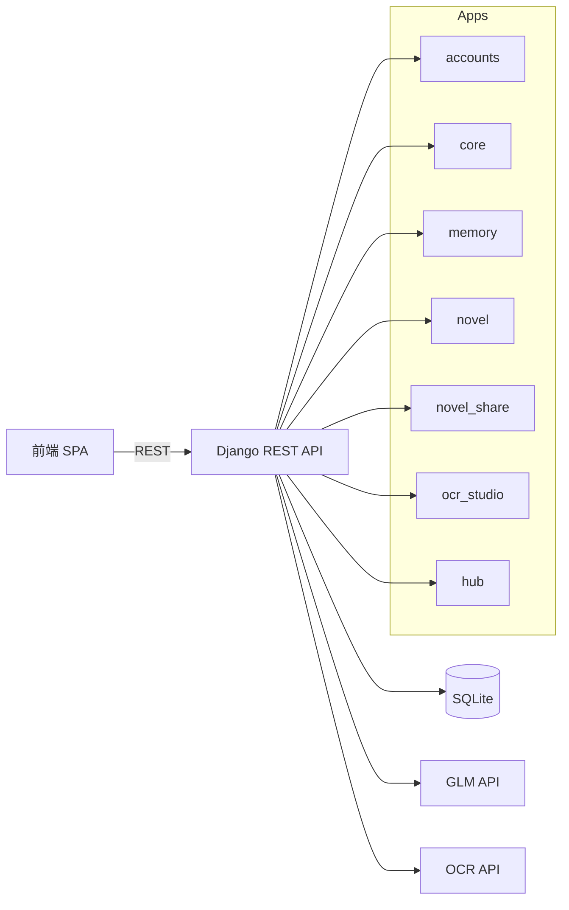
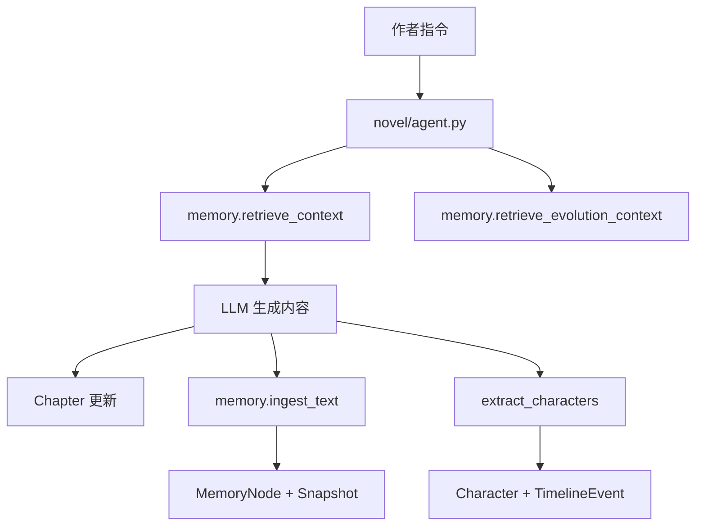
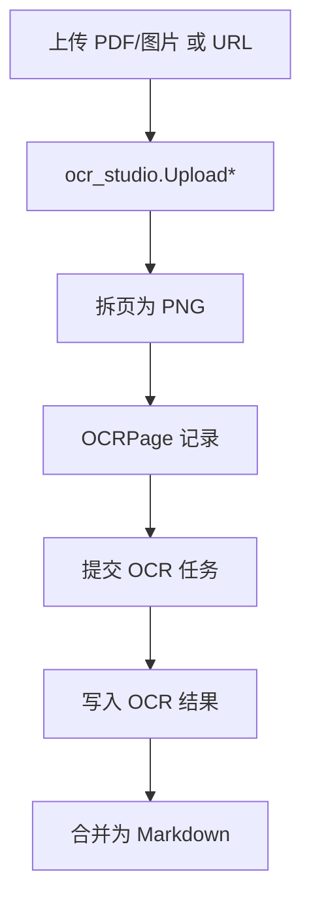

# 系统架构与流程

**总体结构**
- 单体 Django 项目（`memoryforge`）+ 多个业务 app
- 前端为两个模板内嵌的 React SPA（不使用构建工具）
- 数据库默认 SQLite（`db.sqlite3`）
- 外部依赖：GLM（大模型）、OCR API

**应用分层**
- `accounts`：登录/注册、验证码、用户 API Key、Token 用量统计
- `core`：平台 API 配置、LLM 调用、Agent 日志
- `memory`：记忆金字塔、检索与角色/时间线结构化
- `novel`：小说项目与章节生成
- `novel_share`：小说发布、阅读、评论/收藏
- `ocr_studio`：OCR 上传、处理、结果输出
- `hub`：平台应用列表

**核心流程图（概览）**

**写作与记忆流（简化）**

**OCR 流程（简化）**

**关键架构特性**
- 统一 Token 鉴权：DRF Token（`Authorization: Token <key>`）
- 用户级 API Key：允许用户自定义 LLM Key 覆盖平台配置
- 记忆系统：分层结构化存储 + 低成本检索
- OCR：本地持久化图片与结果 Markdown

**需要注意的架构点**
- 默认 `AllowAny` 权限，需依赖各 View 的权限声明
- `core.context` 基于线程局部变量，ASGI 场景需谨慎
- `db.sqlite3` 包含在仓库中，生产建议迁移至外部 DB
